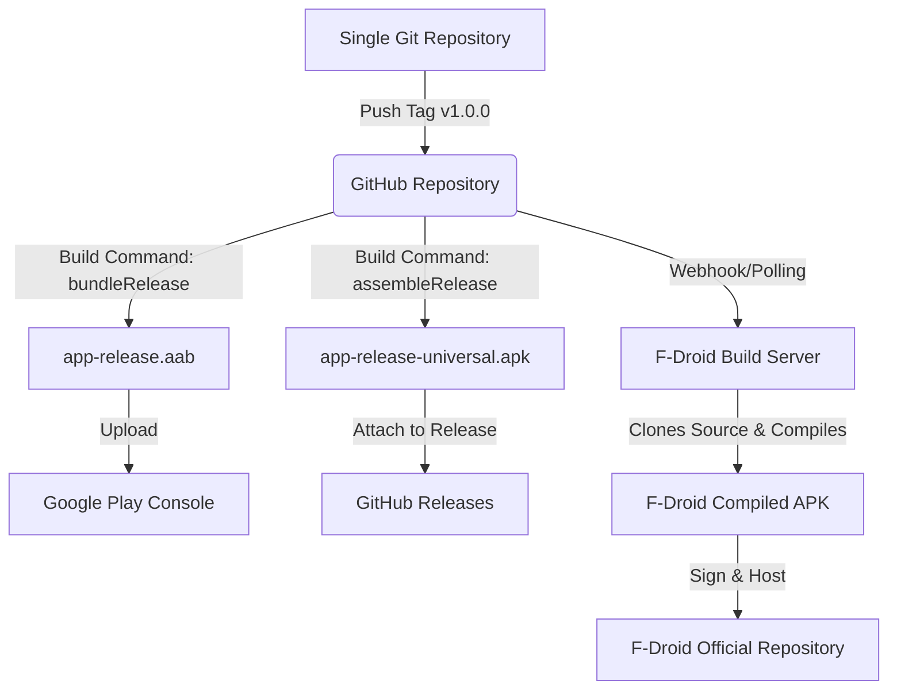

# Multi-Platform Android Distribution Guide: Google Play, GitHub, and F-Droid

This guide outlines how to distribute your Android application to three distinct platforms: the **Google Play Store**, **GitHub Releases**, and **F-Droid**, using a single source code repository.

---

## 1. Overview of Distribution Channels

Here is how the three platforms compare in terms of how they obtain, build, and sign your app:

| Feature | Google Play Store | GitHub Releases | F-Droid |
| :--- | :--- | :--- | :--- |
| **Primary Format** | Android App Bundle (`.aab`) | Universal/Split APK (`.apk`) | Universal/Split APK (`.apk`) |
| **Who Compiles?** | You (Developers compile & upload `.aab`) | You (Developers compile & upload `.apk`) | **F-Droid Build Servers** (Compiled from your source code) |
| **Who Signs?** | Google Play (via Play App Signing) | You (with your private release keystore) | **F-Droid** (with their own official signing keys) |
| **Source Status** | Can be proprietary or open-source | Open-source or public binaries | **Strictly Open-Source** (FOSS) |
| **Proprietary Deps** | Allowed (Firebase, AdMob, Billing, etc.) | Allowed | **Strictly Forbidden** (No proprietary SDKs or binary blobs) |
| **Updates** | Automatic via Play Store app | Manual download or in-app updater | Automatic via F-Droid client app |

---

## 2. Architecture & Release Workflow

You do **not** need three separate directories. Maintaining separate directories would cause duplicate work and sync errors. Instead, use a single git repository. 

Here is how a single repository feeds all three pipelines:



---

## 3. Answering Your Questions

### Can I just upload the AAB-derived APK to GitHub?
**No, not directly.**
* **An AAB is not installable:** An Android App Bundle (`.aab`) is a publishing format that cannot be directly installed on Android devices.
* **Play Store APKs are customized:** The Play Store takes your AAB and splits it into optimized APKs for every user's device (serving only the languages, screen densities, and CPU architectures that specific device needs).
* **For GitHub, you need a Universal APK:** To release on GitHub, you must compile a single standalone `.apk` containing all resources and binary assets so it works on any device. 

### Do I upload the source files to GitHub and F-Droid?
* **For GitHub:** Yes, you push your Git repository (excluding secrets and key files) to a public GitHub repository. You then attach the compiled Universal APK to the release.
* **For F-Droid:** No, you do not upload your source code or APK directly to F-Droid. Instead, you register your public Git repository with F-Droid. Their automated builders fetch your repository, compile it from source, and host it.

### Do I need three separate directories?
**No.** Maintaining three directories is highly discouraged. You can achieve this using a single repository:
1. **Zero-Code-Change Approach (Current Status):** Since your current `app/build.gradle.kts` does not contain any proprietary Google Play SDKs or ads, the exact same code can be compiled for Google Play, GitHub, and F-Droid without changes.
2. **Build Flavors (Optional Future-Proofing):** If you decide to add features like Google Play Billing or Firebase to the Play Store version, you can configure **Build Flavors** (e.g., a `play` flavor and a `foss` flavor) within your single directory. Gradle will generate different versions from the same codebase.

---

## 4. Step-by-Step Implementation Guide

### Phase 1: Configuring Code Signing & Secrets
To distribute on GitHub and let others view your code, you must ensure that your signing keys and credentials are not checked into your public repository.

> [!WARNING]
> Never commit your `release.keystore` or `keystore.properties` to a public Git repository. Doing so compromises your app's security and allows anyone to hijack your application updates.

1. **Verify your `.gitignore`:** Ensure your `keystore.properties` and `.keystore` files are ignored.
   ```text
   # Keystore and passwords
   keystore.properties
   *.keystore
   *.jks
   ```
2. **Local Builds:** Keep these files locally on your machine. Your Gradle script is already set up to read them dynamically (see lines 13-28 in `app/build.gradle.kts`):
   ```kotlin
   val keystorePropertiesFile = rootProject.file("keystore.properties")
   // Configured safely: will only attempt to sign if the keystore file exists locally
   ```

---

### Phase 2: Building for GitHub Releases
To publish a release on GitHub, follow these steps:

#### Step 1: Generate the Universal Release APK
Open your terminal in the project directory and compile the release APK:
```powershell
./gradlew :app:assembleRelease
```
* This compiles the code and signs it with the local keystore specified in your `keystore.properties`.
* The resulting file is generated at: `app/build/outputs/apk/release/app-release.apk` (or `app-release-unsigned.apk` if keys aren't configured).

> [!TIP]
> If you have split APKs configured, you can enable a universal APK fallback in your `app/build.gradle.kts` inside the `android.splits` block:
> ```kotlin
> splits {
>     abi {
>         isEnable = true
>         isUniversalApk = true // Generates a single APK that runs on all architectures
>     }
> }
> ```
> Since splits are not currently declared in your build file, `assembleRelease` already produces a universal APK.

#### Step 2: Publish the Release on GitHub (Manual)
1. Tag your commit:
   ```bash
   git tag -a v1.0.0 -m "Release version 1.0.0"
   git push origin v1.0.0
   ```
2. Go to your GitHub repository -> **Releases** -> **Draft a new release**.
3. Select your tag (`v1.0.0`).
4. Write release notes describing the changes.
5. Drag and drop your compiled `app-release.apk` from `app/build/outputs/apk/release/` into the upload box.
6. Click **Publish release**.

#### Step 3: Automating Releases with GitHub Actions
We have added a workflow file at `.github/workflows/release.yml` that automates this. Since GitHub Actions runs on public repositories for free, you can use it to build and sign your APK automatically when you push a tag.

To set this up, you need to configure your signing keystore securely in your GitHub repository's **Settings -> Secrets and variables -> Actions -> New repository secret**:

1. **Encode your keystore to Base64:**
   * **On Windows (PowerShell):** Run this command to copy the Base64 string of your keystore to your clipboard:
     ```powershell
     [Convert]::ToBase64String([System.IO.File]::ReadAllBytes("release.keystore")) | clip
     ```
   * **On macOS/Linux:** Run this command:
     ```bash
     base64 -i release.keystore | pbcopy
     ```
2. **Add GitHub Secrets:**
   * `RELEASE_KEYSTORE_BASE64`: Paste the Base64 string you just copied.
   * `KEY_ALIAS`: The alias of your release key (from `keystore.properties`).
   * `KEY_PASSWORD`: The password of your key.
   * `STORE_PASSWORD`: The password of your keystore file.

Once configured, pushing a tag like `v1.0.0` to GitHub will trigger the runner to build, sign, and draft a GitHub release with your compiled APK attached automatically!

---

### Phase 3: Submitting to F-Droid

F-Droid is an independent catalog of FOSS (Free and Open Source Software). They build applications themselves to ensure that no proprietary binaries or tracking mechanisms are introduced into the builds.

#### Step 1: Audit Your App for F-Droid Compatibility
Before submitting, check the following:
* **No Proprietary Dependencies:** F-Droid will scan your dependencies. Your current dependencies (androidx, rikka.shizuku, libsu, fastboot-java) are fully open-source.
* **No Precompiled Binary Blobs:** Check that you don't check in `.jar` or `.aar` files directly in your codebase. F-Droid requires dependencies to be fetched from trusted maven repositories.
* **License:** Your repository must include a recognized open-source license (e.g., GPL-3.0, Apache-2.0, MIT) in a `LICENSE` file.

#### Step 2: Submit a Recipe to F-Droid
Instead of uploading an APK, you write a YAML file (known as a **build recipe**) and submit it to the [F-Droid Data Repository](https://gitlab.com/fdroid/fdroiddata).

Here is a simplified example of what your F-Droid recipe (`com.eightybee.app.yml`) will look like:

```yaml
Categories:
  - System
  - Developer
License: Apache-2.0
WebSite: https://github.com/yourusername/yourapp
SourceCode: https://github.com/yourusername/yourapp
IssueTracker: https://github.com/yourusername/yourapp/issues

RepoType: git
Repo: https://github.com/yourusername/yourapp

Builds:
  - versionName: '1.0'
    versionCode: 1
    commit: v1.0.0
    subdir: app
    gradle:
      - yes
```

#### Step 3: Submission Workflow
1. Fork the [fdroiddata](https://gitlab.com/fdroid/fdroiddata) repository on GitLab.
2. Add your new file `templates/com.eightybee.app.yml` (replacing the package name with your exact `applicationId`).
3. Fill in the metadata.
4. Submit a **Merge Request** to F-Droid.
5. F-Droid maintainers will run a build test using their automated tools (`fdroid build`). Once it passes, it gets merged, and within a few days, your app will appear in the F-Droid store.

---

## 5. Setting up Build Flavors (Optional Future-Proofing)

If you ever want to add Play Store-only features (like Google Play Billing, Google Play In-App Updates, or Firebase Analytics) but want to keep the F-Droid/GitHub versions completely free of proprietary code, you can use **Gradle Build Flavors**.

Here is how you would configure it in [app/build.gradle.kts](file:///E:/dev/80bee/app/build.gradle.kts):

```kotlin
android {
    ...
    flavorDimensions.add("distribution")

    productFlavors {
        create("play") {
            dimension = "distribution"
            // Play Store configuration (e.g. customized applicationId suffix if needed)
        }
        create("foss") {
            dimension = "distribution"
            // F-Droid / GitHub configuration
        }
    }
}

dependencies {
    // Standard shared dependencies
    implementation("androidx.core:core-ktx:1.12.0")

    // Play-only proprietary dependency (prefix with playImplementation)
    playImplementation("com.google.android.play:app-update-ktx:2.1.0")
    playImplementation("com.google.firebase:firebase-analytics-ktx:21.5.0")

    // Foss-only open-source replacements if needed (prefix with fossImplementation)
    // fossImplementation(...)
}
```

This creates two sets of build variants:
* `playRelease`: Generates the AAB with Google Services dependencies included.
* `fossRelease`: Generates the APK without any Google Services dependencies included.

You would organize any flavor-specific source code files in matching folders:
* `app/src/main/java` (Shared source code)
* `app/src/play/java` (Code that only executes in the Play Store build, e.g., billing initialization)
* `app/src/foss/java` (Code that replaces play functionality in the open-source build, e.g., dummy/offline billing mocks)
